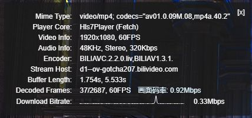
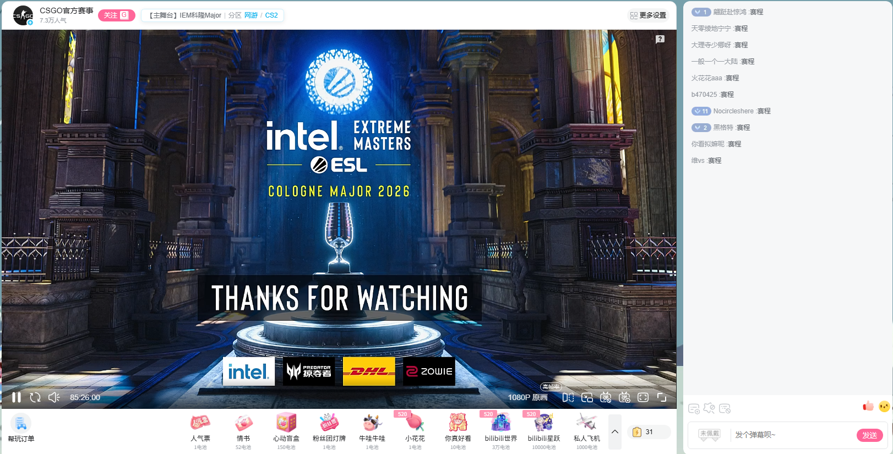

# Bilibili 直播 Tampermonkey 插件合集

一组用于优化 B 站直播页面的 Tampermonkey 脚本，覆盖普通直播间礼物面板、直播标题与分区显示、播放器统计信息增强，以及特殊聚合直播页的播放器布局和跳转。

## 插件列表

| 插件 | 版本 | 功能 | GitHub 安装 | GreasyFork |
| --- | --- | --- | --- | --- |
| B站直播礼物面板布局重构 | 1.1.5 | 重构礼物大面板布局，将面板固定在播放器右下角并保持两行高度，避免挤压视频画面。 | [安装](https://raw.githubusercontent.com/JumpTwiceShou/bilibili-live-tampermonkey-scripts/main/bilibili-live-gift-panel-overlay.user.js) | [GreasyFork](https://greasyfork.org/zh-CN/scripts/581314-bilibili-live-gift-panel-overlay) |
| B站直播间标题与分区显示 | 1.1 | 在标题栏重新显示直播标题、父分区和子分区，并为分区添加跳转链接。 | [安装](https://raw.githubusercontent.com/JumpTwiceShou/bilibili-live-tampermonkey-scripts/main/bilibili-live-room-area-badge.user.js) | [GreasyFork](https://greasyfork.org/zh-CN/scripts/581316-bilibili-live-room-area-badge) |
| B站直播视频统计面板画面码率 | 1.1.0 | 在播放器右键视频统计信息面板的 Decoded Frames 行旁显示估算画面码率。 | [安装](https://raw.githubusercontent.com/JumpTwiceShou/bilibili-live-tampermonkey-scripts/main/bilibili-live-video-bitrate-stats.user.js) | [GreasyFork](https://greasyfork.org/zh-CN/scripts/581368-b站直播视频统计面板画面码率) |
| B站特殊聚合直播跳转普通播放器 | 1.0.2 | 识别特殊聚合页内嵌的 `/blanc/` 播放器并跳转到普通播放器页面。 | [安装](https://raw.githubusercontent.com/JumpTwiceShou/bilibili-live-tampermonkey-scripts/main/bilibili-live-special-blanc-redirect.user.js) | [GreasyFork](https://greasyfork.org/zh-CN/scripts/581317-bilibili-live-special-blanc-redirect) |
| B站特殊聚合页普通直播间布局（保留列表） | 2.2.1 | 特殊聚合页加宽为接近普通直播间的布局，保留聚合列表，列表默认折叠一次，并补齐关注侧栏和回到播放器按钮。 | [安装](https://raw.githubusercontent.com/JumpTwiceShou/bilibili-live-tampermonkey-scripts/main/bilibili-live-special-layout.user.js) | [GreasyFork](https://greasyfork.org/zh-CN/scripts/581318-bilibili-live-special-layout) |
| B站特殊聚合页普通直播间布局（隐藏列表） | 2.2.1-no-list | 特殊聚合页加宽为接近普通直播间的布局，隐藏聚合列表，并补齐关注侧栏和回到播放器按钮。 | [安装](https://raw.githubusercontent.com/JumpTwiceShou/bilibili-live-tampermonkey-scripts/main/bilibili-live-special-layout-no-list.user.js) | [GreasyFork](https://greasyfork.org/zh-CN/scripts/581319-bilibili-live-special-layout-no-list) |

## 使用方法

1. 安装 [Tampermonkey](https://www.tampermonkey.net/) 或其他用户脚本管理器。
2. 按上表选择脚本安装。普通直播间可启用礼物面板布局重构、标题分区显示和视频统计面板画面码率。
3. 特殊聚合页有三种互斥方案：
   - 想保留聚合列表：启用 `B站特殊聚合页普通直播间布局（保留列表）`。
   - 想隐藏聚合列表：启用 `B站特殊聚合页普通直播间布局（隐藏列表）`。
   - 想直接进入普通播放器：启用 `B站特殊聚合直播跳转普通播放器`，同时关闭两个特殊聚合页布局脚本。
4. 如果页面结构更新导致脚本失效，请在 [Issues](https://github.com/JumpTwiceShou/bilibili-live-tampermonkey-scripts/issues) 反馈页面地址、脚本版本和截图。

## 效果参考

### 礼物面板布局重构

修改前：


修改后：


### 标题与分区显示


### 视频统计面板画面码率

启用后，在直播播放器右键菜单中打开“视频统计信息”，`Decoded Frames` 行的 FPS 右侧会显示近 10 秒平均画面码率。



### 特殊聚合页跳转普通播放器

使用前：


使用后：



### 特殊聚合页布局（保留列表）


### 特殊聚合页布局（隐藏列表）


## 控制台验证

启用脚本后，可以在浏览器控制台检查对应版本：

```js
document.documentElement.dataset.bliveGiftPanelOverlayVersion
document.documentElement.dataset.bliveSpecialLayoutVersion
document.documentElement.dataset.bliveRoomAreaBadgeVersion
document.documentElement.dataset.bliveSpecialBlancRedirectVersion
document.documentElement.dataset.bliveVideoBitrateStatsVersion
```

## 开发与校验

`bilibili-live-special-layout.user.js` 是特殊布局的唯一维护源；隐藏列表版本由生成器产出，不要直接编辑。

```powershell
node scripts/generate-special-layout-no-list.mjs
node scripts/validate-userscripts.mjs
```

生成器的 `--check` 模式只检查产物是否同步。静态校验会检查全部用户脚本语法、元数据与运行时版本一致性、隐藏列表生成一致性，以及布局收缩、视口边界和侧栏 URL 安全约束。

如本机可解析 Playwright，可运行 `node debug-special-page.mjs` 做真实页面验证。脚本默认使用无头 Chrome；可通过 `PAGE_URL`、`SCRIPT_PATH`、`EXPECTED_MODE`、`HEADLESS=0`、`SKIP_WEB_MODE=1`、`BROWSER_CHANNEL=bundled` 或 `PLAYWRIGHT_ENTRY` 调整运行环境。

## 许可证

本项目使用 [GNU General Public License v3.0 only](LICENSE) 发布。
